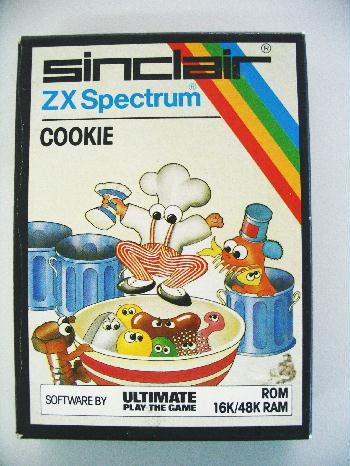

# ML-Labtime-task-0


# Installing all the things
You will need most of the below, feel free to install all of them, or install them as you need them, each task will contain a list of what is needed

Fire up a terminal and run all the commands in boxes

```
Like this one, but dont do this one
``` 

# Text editor of your choice
I recommend Visual Studio code, Notepad++ or Sublime Text also work

# Homebrew
Install homebrew: https://brew.sh/

# NPM
For all our javascript needs we will need NPM

```
brew  install node
```

# Python
Install python 3 and then some useful packages used in the tasks

``` brew install python3'''
    pip3 install pandas
    pip3 install msgpack-python
    pip3 install numpy
    pip3 install glob2
    pip3 install tqdm
    pip3 install py-midi
``` 

# Tenserflow
We are using the CPU only version which can be installed as per below

```
 pip install tensorflow
 ``` 

# Git
We will be using some stub repos so git going!
```
 brew install git
 ``` 

# Data Data and More Data
To learn things you need things to learn from, our various tasks will have a variety of inputs, and you can create models that can make music out of almost anything.  The ultimate goal of Labtime will be to make music with our models, but to do that, here we need sweet data!

Here are some ideas of where to find data!

## Midi
Most of the tools we have encountered that accept music directly as training data uses MIDI files

MIDI files : [Largest collection of midi files in the universe](https://www.reddit.com/r/datasets/comments/3akhxy/the_largest_midi_collection_on_the_internet/)

## History
Use Finna to find artifacts of Finnish history, be it poetry, images, war stories, or even bachelors theses (remember to filter by what is available online)

Finnish history : https://www.finna.fi/

## Images
Royalty free stock photos?  Yes please!

Images : https://www.freeimages.com/

## Other potential sources of data
### Nasa
Use NASAs apis as described in our our recruitment task!

NASA APIs : https://api.nasa.gov/

### Weather
Turn winter blues into actual blues

Weather APIs : https://openweathermap.org/api

### Twitter
Turn humanitys stream of conciousness into true beauty

Twitter : https://twitter.com

# For those that have read this far
Well done! Have cookie!



### Cheat links
Have some cheat links to preview some of things we might be doing on Friday:

Playground : https://playground.tensorflow.org

Magenta : https://magenta.tensorflow.org/

Tensorflow graphs : https://www.tensorflow.org/guide/graphs

MuseGAN : https://salu133445.github.io/musegan/

GAN : https://en.wikipedia.org/wiki/Generative_adversarial_network

RNN : https://en.wikipedia.org/wiki/Recurrent_neural_network

VAE : https://en.wikipedia.org/wiki/Autoencoder#Variational_autoencoder_(VAE) 

